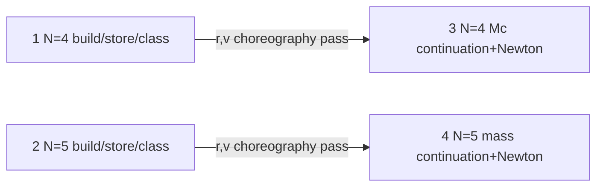

# Equal-mass continuation (implementation notes)

**Design log of record:** [`PROMPT.md`](../../PROMPT.md) at repo root.  
Docs in this folder are **implementation notes** subordinate to PROMPT; on conflict, PROMPT covers them.

| Doc | Role vs PROMPT |
|-----|----------------|
| [PHASES.md](PHASES.md) | Layer mirror of PROMPT §3 / §6 |
| [SEED_STORE.md](SEED_STORE.md) | On-disk schema / verify CLI |
| [SEED_CLASSIFICATION.md](SEED_CLASSIFICATION.md) | Catalogue `orbit_class` after gate |
| [LITERATURE_SEEDS.md](LITERATURE_SEEDS.md) | Pointers for PROMPT §3.1 sources |
| [PATH_A_mc_from_zero.md](PATH_A_mc_from_zero.md) | 4-body \(M_c\!:\!0\uparrow\) script notes |
| [PATH_B_mc_fixed.md](PATH_B_mc_fixed.md) | 5-body / hierarchical mass-scan notes |

Canonical seeds: `fairy_orbit/design/seeds/`.  
Raw imports: `orbit_library/` (gitignored).

